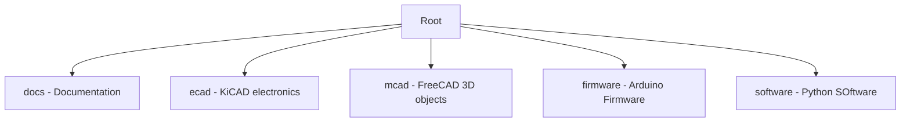

# HearthStone Brooch

An electronics wearable in the shame of the 8-point hearthstone star

## Project Layout

## Electronics Design

## Mechanical Design

## Arduino Firmware Functions
- Creates porogressive brightness shift of LED's to create breathing pattern
- Turns lighting effect on and off
- Any other hardware enhancement functions we dream of

## Python Software
Generates pattern arrays for the blinking waveform.

**NOTE** : This is purely a hobby item. Replicate at your own risk.

